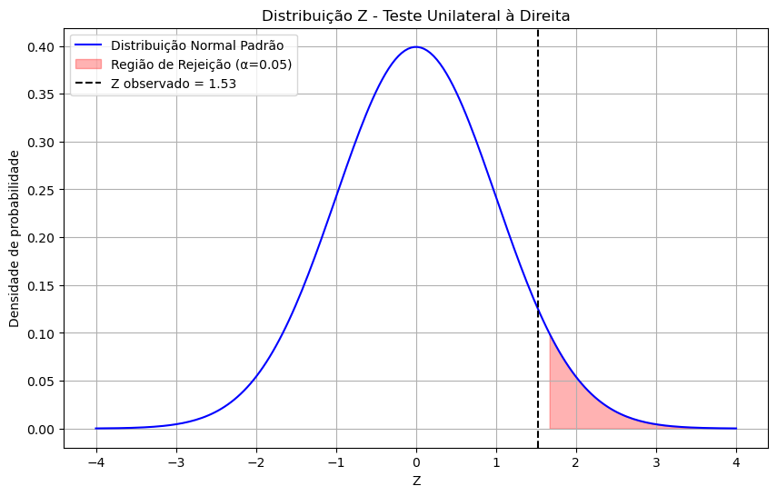

# Applied Statistics - Z Test

---

## Tech Stack | Tecnologias Utilizadas

**EN**
- Jupyter Notebook
- Python
- NumPy
- Matplotlib

**PT-BR**
- Jupyter Notebook
- Python
- NumPy para computacao numerica
- Matplotlib para visualizacao

---

## Executive Summary | Resumo Executivo

**EN**

Hypothesis testing, statistical inference and decision support. This project was organized as a portfolio-ready case study: it explains the objective, the analytical path, the visual evidence and the practical interpretation behind the result.

Main objective: Apply the Z test to evaluate statistical evidence and translate results into clear analytical conclusions.

**PT-BR**

Teste de hipoteses, inferencia estatistica e suporte a decisao. Este projeto foi organizado como um estudo de caso pronto para portfolio: explica o objetivo, o caminho analitico, as evidencias visuais e a interpretacao pratica por tras do resultado.

Objetivo principal: Aplicar o teste Z para avaliar evidencia estatistica e traduzir resultados em conclusoes analiticas claras.

---

## Project Workflow | Fluxo do Projeto

**EN**
- Define the business or analytical question.
- Prepare, clean and structure the available data or inputs.
- Explore patterns through tables, metrics and visualizations.
- Apply statistical logic, SQL, machine learning or application rules when relevant.
- Translate the output into insights, limitations and next steps.

**PT-BR**
- Definir a pergunta de negocio ou de analise.
- Preparar, limpar e estruturar os dados ou entradas disponiveis.
- Explorar padroes por meio de tabelas, metricas e visualizacoes.
- Aplicar logica estatistica, SQL, machine learning ou regras de aplicacao quando fizer sentido.
- Traduzir o resultado em insights, limitacoes e proximos passos.

---

## Data Storytelling | Narrativa dos Dados

### Chapter 1 - Data Understanding | Entendimento dos Dados

**EN**

What the dataset or inputs represent, what each observation means and which business problem is being explored.

**PT-BR**

O que a base ou entradas representam, qual e o significado de cada observacao e qual problema de negocio esta sendo explorado.

**Insight | Insight**
- EN: Visual evidence helps connect the technical result to a concrete decision or interpretation.
- PT-BR: A evidencia visual ajuda a conectar o resultado tecnico a uma decisao ou interpretacao concreta.

### Chapter 2 - Exploratory Analysis | Analise Exploratoria

**EN**

The first visual layer reveals distributions, outliers, concentrations and relationships that guide the rest of the project.

**PT-BR**

A primeira camada visual revela distribuicoes, outliers, concentracoes e relacoes que orientam o restante do projeto.

**Insight | Insight**
- EN: Visual evidence helps connect the technical result to a concrete decision or interpretation.
- PT-BR: A evidencia visual ajuda a conectar o resultado tecnico a uma decisao ou interpretacao concreta.

### Chapter 3 - Modeling / Logic | Modelagem ou Logica

**EN**

The project translates data into decisions using statistical reasoning, rules, SQL logic, machine learning or an interactive workflow.

**PT-BR**

O projeto transforma dados em decisoes usando raciocinio estatistico, regras, logica SQL, machine learning ou fluxo interativo.

**Insight | Insight**
- EN: Visual evidence helps connect the technical result to a concrete decision or interpretation.
- PT-BR: A evidencia visual ajuda a conectar o resultado tecnico a uma decisao ou interpretacao concreta.

### Chapter 4 - Results and Interpretation | Resultados e Interpretacao

**EN**

The outputs are interpreted in practical language so the repository works as both technical evidence and portfolio storytelling.

**PT-BR**

Os resultados sao interpretados em linguagem pratica para que o repositorio funcione como evidencia tecnica e narrativa de portfolio.

**Insight | Insight**
- EN: Visual evidence helps connect the technical result to a concrete decision or interpretation.
- PT-BR: A evidencia visual ajuda a conectar o resultado tecnico a uma decisao ou interpretacao concreta.

---

## Repository Structure | Estrutura do Repositorio

**EN**
- `README.md`: complete bilingual project documentation.
- `*.ipynb`: notebooks with the analytical workflow, experiments or visual exploration.
- `assets/readme/` or chart folders: visual outputs used in this README.

**PT-BR**
- `README.md`: documentacao completa e bilingue do projeto.
- `*.ipynb`: notebooks com o fluxo analitico, experimentos ou exploracao visual.
- `assets/readme/` ou pastas de graficos: saidas visuais usadas neste README.

---

## How to Run | Como Executar

**EN**
1. Clone the repository.
2. Create a virtual environment when the project uses Python.
3. Install the required libraries listed in the notebook/script imports or in `requirements.txt`, when available.
4. Run the notebooks or scripts from the repository root so relative paths keep working.

**PT-BR**
1. Clone o repositorio.
2. Crie um ambiente virtual quando o projeto usar Python.
3. Instale as bibliotecas indicadas nos imports dos notebooks/scripts ou em `requirements.txt`, quando existir.
4. Execute notebooks ou scripts a partir da raiz do repositorio para manter os caminhos relativos funcionando.

---

## Key Takeaways | Principais Aprendizados

**EN**
- The repository is documented as an end-to-end analytical story, not only as code storage.
- Visuals, when available, are placed directly in the README to make the result easier to inspect.
- The bilingual format makes the project accessible to both English and Portuguese readers.

**PT-BR**
- O repositorio esta documentado como uma historia analitica ponta a ponta, nao apenas como armazenamento de codigo.
- Os visuais, quando disponiveis, ficam diretamente no README para facilitar a leitura do resultado.
- O formato bilingue torna o projeto acessivel para leitores em ingles e portugues.

---

## Future Improvements | Proximos Passos

- Add automated chart export to keep README visuals updated.
- Add a `requirements.txt` or environment file when dependencies are needed.
- Include data dictionary, modeling assumptions and evaluation metrics when applicable.
- Adicionar exportacao automatica dos graficos para manter o README atualizado.
- Adicionar `requirements.txt` ou arquivo de ambiente quando houver dependencias.
- Incluir dicionario de dados, premissas de modelagem e metricas de avaliacao quando aplicavel.

---

## Author | Autor

Henry
